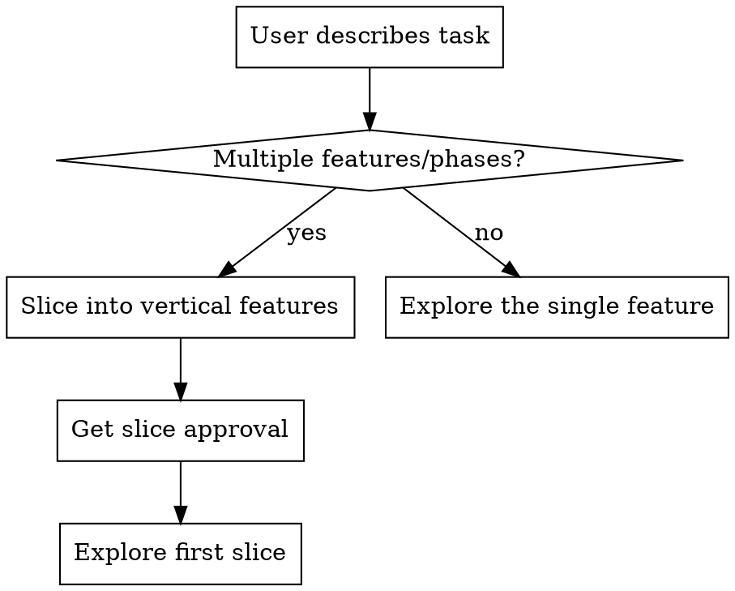

# Create Design

## Overview

Help turn ideas into fully formed designs through natural collaborative dialogue. **Outputs: `docs/specs/<feature>/design.md`**

**First: Check scope.** If the task is large (multiple features/phases), slice it into vertical features before exploring any single one.

Then: Understand the project context, ask questions one at a time, and present the design in small sections (200-300 words), checking after each section.



## The Process

**Scope check (do this first):**
- If the task spans multiple features, phases, or components → slice before exploring
- Ask: "This covers several things. Want to break it into vertical slices first?"
- Each slice should be:
  - Deployable on its own
  - Verifiable (user can see/test something)
  - Builds on previous slices
- Present slices as a table: Phase | Feature | Verifiable Outcome
- Get approval on the slice list, THEN explore the first slice

**Understanding the idea:**
- Check out the current project state first (files, docs, recent commits)
- Ask questions one at a time to refine the idea
- Prefer multiple choice questions when possible, but open-ended is fine too
- Only one question per message - if a topic needs more exploration, break it into multiple questions
- Focus on understanding: purpose, constraints, success criteria

**Exploring approaches:**
- Propose 2-3 different approaches with trade-offs
- Present options conversationally with your recommendation and reasoning
- Lead with your recommended option and explain why

**Presenting the design:**
- Once you believe you understand what you're building, present the design
- Break it into sections of 200-300 words
- Ask after each section whether it looks right so far
- Cover: architecture, components, data flow, error handling, testing
- Be ready to go back and clarify if something doesn't make sense

## After the Design

**Git Workflow:**
```bash
git status  # Verify clean state before writing
```

**Documentation:**
- Write the validated design to `docs/specs/<feature>/design.md`
- Commit the design document:
```bash
git add docs/specs/<feature>/design.md
git commit -m "Add <feature> design"
```

**Domain Model Check:**
- Ask: "Does this feature add or change entities in the domain model?"
- If yes, update `docs/DOMAIN.md` with the data model tree
- The data model tree format shows hierarchy at a glance:

```
Parent Entity
├── Child Entity
├── Another Child
│   └── Grandchild
└── Sibling
```

**Creating Specs:**
- Ask: "Ready to create feature specs?"
- Use `create-spec` to create specs for each feature
- Save specs to `docs/specs/<feature>/spec.md`

**Implementation Planning:**
- After specs are approved, use `create-implementation-plan` to create implementation plan
- Plans reference specs, don't embed code

## For New Projects

When starting a new project (no existing DOMAIN.md):
1. Create `docs/DOMAIN.md` with a **Data Model Overview** tree
2. This gives a bird's eye view of all entities and their relationships
3. Update it as new features add entities

Example data model tree:
```
Organization
├── Members (roles)
├── Projects
│   └── Tasks
│       ├── Subtasks
│       └── Comments
└── Settings
```

## Key Principles

- **Slice first** - If task has multiple features/phases, break into vertical slices before exploring
- **One question at a time** - Don't overwhelm with multiple questions
- **Multiple choice preferred** - Easier to answer than open-ended when possible
- **YAGNI ruthlessly** - Remove unnecessary features from all designs
- **Explore alternatives** - Always propose 2-3 approaches before settling
- **Incremental validation** - Present design in sections, validate each
- **Be flexible** - Go back and clarify when something doesn't make sense
- **Update domain model** - After design, check if DOMAIN.md needs updating

## Relationship to Other Skills

```
feather:create-design  →  feather:create-spec  →  feather:create-plan  →  feather:execute
(design.md)               (spec.md)               (implementation-plan.md)  (build)
```
